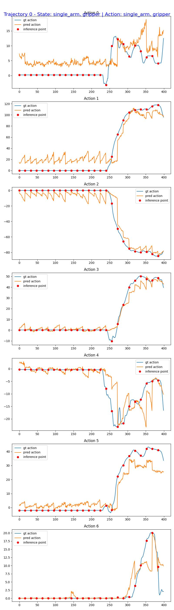

# Finetuning GR00T N1.7 Model for Seeed reBot Arm B601 DM

This guide shows how to finetune dataset collected from [rebot arm b601 dm](https://www.seeedstudio.com/reBot-Arm-B601-DM-Bundle.html) robot, and evaluate the model on the real robot.


## Dataset

To collect the dataset via teleoperation, please refer to the official documentation in lerobot: https://wiki.seeedstudio.com/rebot_arm_b601_dm_lerobot/#calibrate-the-robotic-arm


## Handling the dataset

```bash
uv run --project scripts/lerobot_conversion \
  python scripts/lerobot_conversion/convert_v3_to_v2.py  \
  --root <path-to-lerobot-dataset>
```

Then move the `modality.json` file to the root of the dataset.
```bash
cp examples/rebot-arm-dm/modality.json <path-to-lerobot-dataset>/meta/modality.json
```

## Finetuning

Run the shared finetune launcher directly, using absolute joint positions (feel free to experiment with relative positions):
```bash
CUDA_VISIBLE_DEVICES=0 NUM_GPUS=1 uv run bash examples/finetune.sh \
  --base-model-path nvidia/GR00T-N1.7-3B \
  --dataset-path <path-to-lerobot-dataset> \
  --modality-config-path examples/rebot-arm-dm/rebot_config.py \
  --embodiment-tag NEW_EMBODIMENT \
  --output-dir /tmp/rebot-arm-dm_finetune
```

## Open-Loop Evaluation

Evaluate the finetuned model with the following command:
```bash
uv run python gr00t/eval/open_loop_eval.py \
  --dataset-path <path-to-lerobot-dataset> \
  --embodiment-tag NEW_EMBODIMENT \
  --model-path /tmp/rebot-arm-dm_finetune/checkpoint-10000 \
  --traj-ids 0 \
  --action-horizon 16 \
  --steps 400
```

### Evaluation Results

The evaluation produces visualizations comparing predicted actions against ground truth trajectories:



To read these numbers and decide whether your fine-tune is working, see [Interpreting the Result: Is My Fine-tune Working?](../../getting_started/finetune_new_embodiment.md#interpreting-the-result-is-my-fine-tune-working).

## Closed-Loop Evaluation

Please refer to [eval_rebot_arm_dm.py](../../gr00t/eval/real_robot/rebot-arm-dm/eval_rebot_arm_dm.py) for how to write rebot arm deployment code using Policy API.

1. set up client side deps

```bash
cd gr00t/eval/real_robot/rebot-arm-dm
uv venv
source .venv/bin/activate
uv pip install -e . --verbose
uv pip install --no-deps -e ../../../../
```

2. Start policy server from the repository root in a separate terminal:
```bash
uv run python gr00t/eval/run_gr00t_server.py \
  --model-path /tmp/so100_finetune/checkpoint-10000 \
  --embodiment-tag NEW_EMBODIMENT 
```

3. Run the eval script as the client from the `gr00t/eval/real_robot/rebot-arm-dm` environment created above:
```bash
python eval_rebot_arm_dm.py \
  --robot.type=seeed_b601_dm_follower \
  --robot.id=b601_dm_follower \
  --robot.port=/dev/ttyACM0 \
  --robot.can_adapter=damiao \
  --robot.cameras="{ front: {type: opencv, index_or_path: /dev/video0, width: 640, height: 480, fps: 30}, side: {type: opencv, index_or_path: /dev/video2, width: 640, height: 480, fps: 30}}" \
  --policy_host=localhost \
  --policy_port=5555 \
  --lang_instruction="organize test tube"
```
