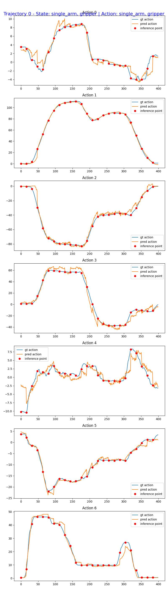

# Finetuning GR00T N1.7 for Seeed reBot Arm B601 RS

This guide shows how to prepare a LeRobot dataset collected with the [Seeed reBot
Arm B601 RS](https://www.seeedstudio.com/reBot-Arm-B601-RS-Bundle-p-6898.html), finetune GR00T N1.7, evaluate the checkpoint offline, and deploy it
on the real robot.

## Dataset

Collect demonstrations with a B601-RS follower and two RGB cameras. The expected
LeRobot features are:

| Modality | Source keys | GR00T keys |
| --- | --- | --- |
| Video | `observation.images.front`, `observation.images.side` | `front`, `side` |
| State | `observation.state[0:6]`, `observation.state[6:7]` | `single_arm`, `gripper` |
| Action | `action[0:6]`, `action[6:7]` | `single_arm`, `gripper` |
| Language | `task_index` | `annotation.human.task_description` |

To collect the dataset via teleoperation, please refer to the official documentation in lerobot: 

https://wiki.seeedstudio.com/rebot_arm_b601_rs_lerobot/#data-collection

The commands below use the test tube organization dataset as an example

[youjiang97/grab_tube_0](https://huggingface.co/datasets/youjiang97/grab_tube_0)


## Handling the Dataset

GR00T N1.7 expects the LeRobot v2 layout. Convert a LeRobot v3 dataset from the
repository root:

```bash
uv run --project scripts/lerobot_conversion \
  python scripts/lerobot_conversion/convert_v3_to_v2.py \
  --repo-id youjiang97/grab_tube_0 \
  --root <path-to-dataset-parent>
```

The converter replaces the dataset with the v2 version and keeps a backup of
the original v3 data. Then install the RS modality mapping:

```bash
cp examples/rebot-arm-rs/modality.json \
  <path-to-lerobot-dataset>/meta/modality.json
```

For another dataset, replace both the repository ID and local path.

## Finetuning

Run the shared finetuning launcher from the repository root:

```bash
CUDA_VISIBLE_DEVICES=0 NUM_GPUS=1 uv run bash examples/finetune.sh \
  --base-model-path nvidia/GR00T-N1.7-3B \
  --dataset-path <path-to-lerobot-dataset> \
  --modality-config-path examples/rebot-arm-rs/rebot_arm_rs_config.py \
  --embodiment-tag NEW_EMBODIMENT \
  --output-dir /tmp/rebot-arm-rs_finetune
```

The resulting checkpoint contains the `new_embodiment` processor configuration,
normalization statistics, two camera modalities, six arm joints, and one
gripper joint.

## Open-Loop Evaluation

Evaluate a finetuned checkpoint without connecting the robot:

```bash
uv run python gr00t/eval/open_loop_eval.py \
  --dataset-path <path-to-lerobot-dataset> \
  --embodiment-tag NEW_EMBODIMENT \
  --model-path /tmp/rebot-arm-rs_finetune/checkpoint-10000 \
  --traj-ids 0 \
  --execution-horizon 16 \
  --steps 400 \
  --save-plot-path /tmp/open_loop_eval_rebot_arm_rs.png
```

Replace `--model-path` with `/home/seeed/a100/checkpoint-10000` to evaluate the
current local checkpoint.



The evaluation compares predicted actions against the recorded trajectory. See
[Interpreting the Result: Is My Fine-tune Working?](../../getting_started/finetune_new_embodiment.md#interpreting-the-result-is-my-fine-tune-working)
for guidance on the reported MSE, MAE, and plots.

## Closed-Loop Evaluation

The real-robot client is
[eval_rebot_arm_rs.py](./eval_rebot_arm_rs.py). It uses a lightweight ZeroMQ client, so the GPU policy server and the robot client run in separate processes.

### 1. Install Robot-Side Dependencies

Use a Python 3.12 LeRobot environment on the machine connected to the arm:

```bash
cd examples/rebot-arm-rs
uv venv
source .venv/bin/activate
uv pip install -e . --verbose
uv pip install --no-deps -e ../../
```

### 2. Start the Policy Server

From the Isaac-GR00T repository root, start the server in its own terminal:

```bash
uv run --no-sync python gr00t/eval/run_gr00t_server.py \
    --model-path /tmp/rebot-arm-rs_finetune/checkpoint-10000 \
    --embodiment-tag NEW_EMBODIMENT \
```

Wait until the server reports that it is listening on port `5555`.

If the policy server runs on another machine, use `--host 0.0.0.0` and pass the
server's LAN address to the client with `--policy-host`.

### 3. Run on the Real Robot
```bash
uv run python examples/rebot-arm-rs/eval_rebot_arm_rs.py \
    --robot-port can0 \
    --robot-id follower1 \
    --front-camera /dev/video0 \
    --side-camera /dev/video6 \
    --policy-host 127.0.0.1 \
    --policy-port 5555 \
    --instruction "Organize test tube" \
    --duration-s 25 \
    --execute
```
Please adjust the camera ID according to your actual setup.

Clear the robot workspace, keep the emergency stop ready, and place the arm near the demonstrated reset pose before starting this command. With `--execute`, the client connects to the robot and begins control without an additional prompt.

## Runtime and Safety Behavior

- The client sends actions at 30 Hz and executes eight time-aligned actions per policy request.
- Overlapping arm predictions are aligned and blended before delta-clamp, EMA, velocity, and acceleration limiting.
- The gripper target passes through directly so grasp and release transitions are not delayed.
- `SeeedB601RSFollower.send_action()` applies command-space directions `[1, 1, -1, -1, -1, 1, 6]` and physical joint limits.
- Normal completion, Ctrl+C, and recoverable execution errors trigger a smooth joint-space return to the startup pose before torque is disabled.
- Press Ctrl+C a second time during return to abort motion and request immediate torque disable.
