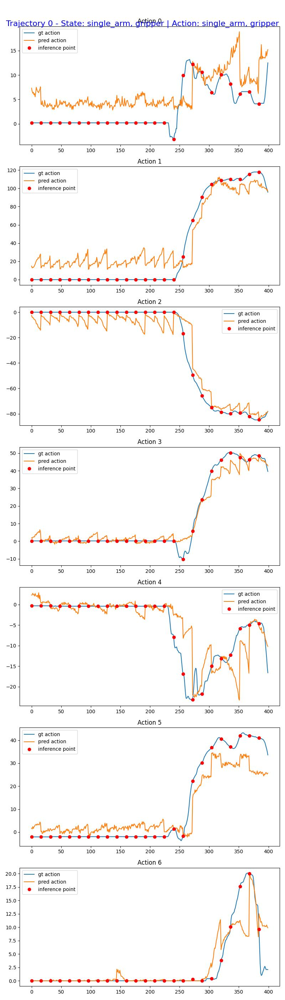

# Finetuning GR00T N1.7 for Seeed reBot Arm B601 (DM and RS)

This guide shows how to prepare a LeRobot dataset, finetune GR00T N1.7, evaluate a checkpoint offline, and deploy it on either supported Seeed reBot
Arm B601 variant.

## Supported Variants

| Variant | Product | Real-robot client |
| --- | --- | --- |
| B601-DM | [Seeed reBot Arm B601 DM](https://www.seeedstudio.com/reBot-Arm-B601-DM-Bundle.html) | [eval_rebot_arm_dm.py](./eval_rebot_arm_dm.py) |
| B601-RS | [Seeed reBot Arm B601 RS](https://www.seeedstudio.com/reBot-Arm-B601-RS-Bundle-p-6898.html) | [eval_rebot_arm_rs.py](./eval_rebot_arm_rs.py) |

Both variants use the same GR00T modality layout and shared
[rebot_config.py](./rebot_config.py). Their real-robot clients remain separate because the DM and RS models use different hardware interfaces and control
behavior.

## Dataset

Collect demonstrations with a B601 follower and two RGB cameras. The expected LeRobot features are:

| Modality | Source keys | GR00T keys |
| --- | --- | --- |
| Video | observation.images.front, observation.images.side | front, side |
| State | observation.state[0:6], observation.state[6:7] | single_arm, gripper |
| Action | action[0:6], action[6:7] | single_arm, gripper |
| Language | task_index | annotation.human.task_description |

Use the documentation and example dataset for your hardware variant:

| Variant | Data-collection guide | Example dataset |
| --- | --- | --- |
| B601-DM | [LeRobot data collection for B601-DM](https://wiki.seeedstudio.com/rebot_arm_b601_dm_lerobot/#calibrate-the-robotic-arm) | [youjiang97/organize_test_tube_0](https://huggingface.co/datasets/youjiang97/organize_test_tube_0) |
| B601-RS | [LeRobot data collection for B601-RS](https://wiki.seeedstudio.com/rebot_arm_b601_rs_lerobot/#data-collection) | [youjiang97/grab_tube_0](https://huggingface.co/datasets/youjiang97/grab_tube_0) |

## Handling the Dataset

GR00T N1.7 expects the LeRobot v2 layout. Convert a LeRobot v3 dataset from the repository root:

~~~bash
uv run --project scripts/lerobot_conversion \
  python scripts/lerobot_conversion/convert_v3_to_v2.py \
  --repo-id <dataset-repo-id> \
  --root <path-to-lerobot-dataset>
~~~

For example, use youjiang97/organize_test_tube_0 for the DM dataset or youjiang97/grab_tube_0 for the RS dataset. The converter replaces the dataset with the v2 version and keeps a backup of the original v3 data.

Install the shared reBot modality mapping after conversion:

~~~bash
cp examples/rebot-arm/modality.json \
  <path-to-lerobot-dataset>/meta/modality.json
~~~

## Finetuning

Run the shared finetuning launcher from the repository root:

~~~bash
CUDA_VISIBLE_DEVICES=0 NUM_GPUS=1 uv run bash examples/finetune.sh \
  --base-model-path nvidia/GR00T-N1.7-3B \
  --dataset-path <path-to-lerobot-dataset> \
  --modality-config-path examples/rebot-arm/rebot_config.py \
  --embodiment-tag NEW_EMBODIMENT \
  --output-dir /tmp/rebot-arm_finetune
~~~

## Open-Loop Evaluation

Evaluate a finetuned checkpoint without connecting the robot:

~~~bash
uv run python gr00t/eval/open_loop_eval.py \
  --dataset-path <path-to-lerobot-dataset> \
  --embodiment-tag NEW_EMBODIMENT \
  --model-path /tmp/rebot-arm_finetune/checkpoint-10000 \
  --traj-ids 0 \
  --execution-horizon 16 \
  --steps 400 \
  --save-plot-path /tmp/open_loop_eval_rebot_arm.png
~~~

The evaluation compares predicted actions against the recorded trajectory. See [Interpreting the Result: Is My Fine-tune Working?](../../getting_started/finetune_new_embodiment.md#interpreting-the-result-is-my-fine-tune-working) for guidance on the reported MSE, MAE, and plots.

### B601-DM Evaluation Example

### B601-RS Evaluation Example

## Closed-Loop Evaluation

The GPU policy server and robot client run as separate processes. Select the client that matches the connected B601 variant.

### 1. Install Robot-Side Dependencies

On the machine connected to the arm:

~~~bash
cd examples/rebot-arm
uv venv
source .venv/bin/activate
uv pip install -e . --verbose
uv pip install --no-deps -e ../../
cd ../../
~~~

### 2. Start the Policy Server

From the Isaac-GR00T repository root, start the server in a separate terminal:

~~~bash
uv run python gr00t/eval/run_gr00t_server.py \
  --model-path /tmp/rebot-arm_finetune/checkpoint-10000 \
  --embodiment-tag NEW_EMBODIMENT
~~~

Wait until the server reports that it is listening on port 5555. If it runs on another machine, use --host 0.0.0.0 on the server and pass that machine's LAN address to the robot client.

### 3. Run the eval script as client

In a second terminal, run the eval script as the client.

#### B601-DM Client

~~~bash
cd <path-to-isaac-gr00t-repo>/examples/rebot-arm
uv run python eval_rebot_arm_dm.py \
  --robot.type=seeed_b601_dm_follower \
  --robot.id=b601_dm_follower \
  --robot.port=/dev/ttyACM0 \
  --robot.can_adapter=damiao \
  --robot.cameras="{ front: {type: opencv, index_or_path: /dev/video0, width: 640, height: 480, fps: 30}, side: {type: opencv, index_or_path: /dev/video2, width: 640, height: 480, fps: 30}}" \
  --policy_host=localhost \
  --policy_port=5555 \
  --lang_instruction="organize test tube"
~~~

Adjust the serial port, CAN adapter, camera devices, and instruction for the actual setup.

#### B601-RS Client

~~~bash
cd <path-to-isaac-gr00t-repo>/examples/rebot-arm
uv run python eval_rebot_arm_rs.py \
  --robot-port can0 \
  --robot-id follower1 \
  --front-camera /dev/video0 \
  --side-camera /dev/video6 \
  --policy-host 127.0.0.1 \
  --policy-port 5555 \
  --instruction "Organize test tube" \
  --duration-s 25 \
  --execute
~~~

Adjust the CAN interface and camera devices for the actual setup.

Runtime and Safety Notes:
- Use a checkpoint trained with data from the same B601 variant being controlled.
- Clear the robot workspace, keep the emergency stop ready, and place the arm near the demonstrated reset pose before closed-loop evaluation.
- The RS client aligns and blends overlapping arm predictions before delta clamping, EMA, velocity limiting, and acceleration limiting. Gripper targets pass through directly so grasp and release transitions are not delayed.
- SeeedB601RSFollower.send_action() applies command-space directions [1, 1, -1, -1, -1, 1, 6] and physical joint limits.
- Normal RS completion, Ctrl+C, and recoverable execution errors trigger a smooth joint-space return to the startup pose before torque is disabled.
- Press Ctrl+C a second time during the RS return to abort motion and request immediate torque disable.
