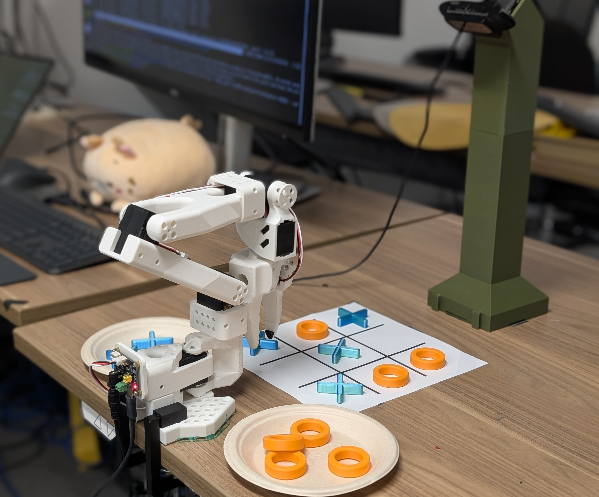

# Examples

## Modality.json

This provides additional examples of `modality.json` for different lerobot datasets. Copy the relevant `modality.json` to the dataset`<DATASET_PATH>/meta/modality.json`

`eval_gr00t_so100.py` provides an example of how to use the finetuned model to generate policy rollouts.

## Eval GR00T N1 on SO100

The `eval_gr00t_so100.py` script provides an example of how to use the finetuned model to run policy rollouts on a SO100 robot arm.

## Tic-Tac-Toe Bot

This showcases the example of using a VLM as a high-level task planner (system 2) to plan the next action in a tic-tac-toe game, and GR00T N1 as the low-level action executor (system 1). This showcases language-conditioned on a GR00T N1 VLA. (e.g. "Place the circle to the bottom left corner box")

 * Example script: [tictac_bot.py](./tictac_bot.py)
 * [Example dataset](https://huggingface.co/datasets/youliangtan/tictac-bot)
