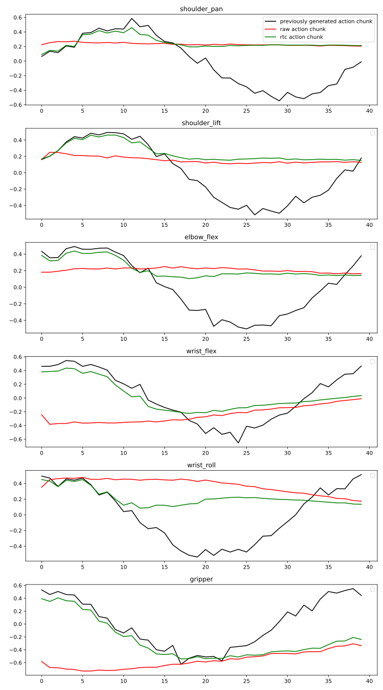
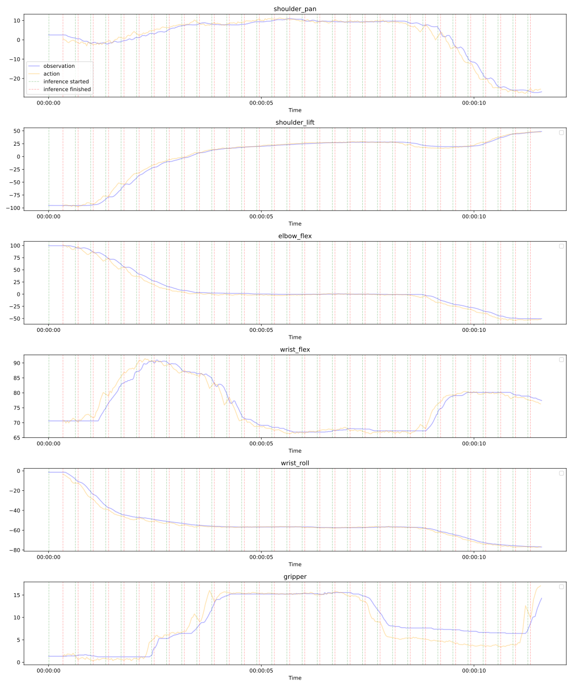
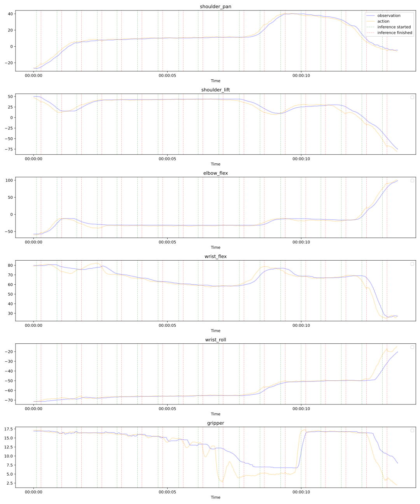

# Real-Time Action Chunking

When naively performing inference and executing the predicted actions, the gradually predicted actions lead to a jittery motion of the robot.
So to infer smooth robot trajectories using the Gr00t-model, we are using the real-time action chunking technique proposed by [Physical Intelligence](https://www.physicalintelligence.company/research/real_time_chunking).  
This technique consists of two main parts: **asynchronous inference** and **action inpainting**.

## Asynchronous Inference

The idea behind asynchronously executing inference is that every time an action is requested, the model can immediately deliver one. This is done by running the inference in a separate thread when new actions are needed.
But this method intensifies a major issue: by naively performing inference, a gap between the old and new actions will occur and lead to a jittery motion of the robot.

## Action Inpainting

To create smooth robot movements over multiple action chunks, the [paper of Physical Intelligence](https://www.physicalintelligence.company/download/real_time_chunking.pdf) proposes a method of **action inpainting**.

The idea of this approach is to freeze the first few actions of the newly inferred action chunk and fill them with already known actions from a previous inference. This way, the robot can continue requesting actions from the model while consistency is still guaranteed as the new action chunk consider that the freezed actions are executed.
Then, based on these freezed actions, the remaining actions of the new action chunk are predicted. In the following, a brief overview of the inpainting-method is given, more details about action inpainting can be read on the mentioned website and paper of Physical Intelligence.

### Basics

The inpainting algorithm assumes a flow model like Gr00t. This model is then extended to perform action inpainting.

A common flow model works as follows: if you want to generate an action chunk $A_t = [a_t, a_{t+1}, ..., a_{t+H - 1}]$ with the size $H$ at the time step $t$, first a noised action chunk $A^0_t \sim N(0, 1)$ is randomly selected. This action chunk is then iteratively denoised by the model using $n$ denoising steps until a fully denoised action chunk $A^1_t = A_t$ is created.  
This is done as follows:

> **Algorithm 1: Standard Denoising Algorithm**
> 
> **Input:** Noised action chunk $A^0_t$, current observation $o_t$
> 
> **For** $\tau = \{0, \frac{1}{n}, \frac{2}{n}, .., 1 - \frac{1}{n}\}$:
> 
> $$A^{\tau + \frac{1}{n}}_t = A^{\tau}_t + \frac{1}{n} \cdot v(A^\tau_t, o_t, \tau)$$
> 
> **Output:** Fully denoised action chunk $A^1_t$
> 
> where $v(A^\tau_t, o_t, \tau)$ is a velocity predicted by the flow model given the current action chunk $A^{\tau}_t$, the current observation $o_t$ and $\tau$.

### Extension: Inference-Time Inpainting

Now, given the default inference algorithm, Physical Intelligence proposes a method to change the velocity used to update the noised action chunks to enable inpainting. The changed velocity $v_{\Pi GDM}(A^\tau_t, o_t, \tau)$ given the default velocity $v(A^\tau_t, o_t, \tau)$ of the model is calculated as follows:

> **Algorithm 2: Modified Velocity Calculation for Action Inpainting**
> 
> $$v_{\Pi GDM}(A^\tau_t, o_t, \tau) = v(A^\tau_t, o_t, \tau) + \min\left( \beta, \frac{1-\tau}{\tau \cdot r^2_\tau} \right) \left( Y - \hat{A^{1}_t} \right)^\top \text{diag}(W) \frac{\partial \hat{A^{1}_t}}{\partial A^\tau_t}$$
> 
> **where:**
> 
> $$\hat{A^{1}_t} = A^{\tau}_t + (1 - \tau)\, v(A^{\tau}_t, o_t, \tau)$$
> 
> $$r^2_{\tau} = \frac{(1 - \tau)^2}{\tau^2 + (1 - \tau)^2}$$

Here, $\beta$ is a guidance weight clipping parameter, $Y$ is the target action chunk where the newly created action chunk should be aligned to and $W$ is a weight vector with each entry $\in [0, 1]$, so that 1 means that the corresponding action should be fully aligned to the action in $Y$ and 0 means that the corresponding action is free.

**Note:** As the actions in $Y$ are the remaining actions which were not yet executed when the inference started, $Y$ must be padded to have the same size $H$ as $A_t$.

## Implementation

The implementation of this adapted denoising algorithm for Gr00t is done in the `rtc` package. This implementation is inspired by the [implementation of Physical Intelligence](https://github.com/Physical-Intelligence/real-time-chunking-kinetix/blob/220422fa9b4abb4a3e582fe4c5fba9485556b2e0/src/model.py#L214).  
**Note:** the implementation of Physical Intelligence is using JAX, but as Gr00t is using Torch, thus, our code is also using Torch instead of JAX. 
More details about the implementation can be found in the `README.md`-file of the folder.

**Important Note:** as mentioned in `rtc_flow_matching_action_head.py` and different to the calculation of $v_{\Pi GDM}(A^\tau_t, o_t, \tau)$ as described above, the gradient $\frac{\partial \hat{A^{1}_t}}{\partial A^\tau_t}$ is **not used in our implementation** because not using it seems to lead to better results.

## Evaluation

In the following, the impact of using the proposed RTC method during action chunk inference is evaluated. 

First, the effect of using RTC is visualized. In the figure below, the results of using RTC and not using RTC are compared. Here it is assumed, that the robot is currently executing the actions represented by the black line and starts a new inference at time step 0. This inference needs 10 time steps to finish, during this time the robot keeps executing actions represented by the black line. When the inference is finished, the robot starts executing the newly inferred actions.

It can be observed that using RTC leads to a smooth transition from the previously generated action chunk to the newly generated one. This is important because during action chunk inference, the robot keeps moving and when the inference finishes and the robot starts executing the newly inferred actions, the robot stays on a smooth trajectory whereas without RTC, the robot jumps to the new action chunks. It is also important to note that the actions inferred with RTC are approaching the actions inferred without RTC after the transition is made. This shows that RTC creates a smooth transition between two action chunks while preserving the correctness of the generated action chunk.

*Figure 1: Visualization of the effect of RTC. Assuming a previously generated action chunk which is executed right now by the robot, represented by the black line. Now, at time step 0, a new action chunk should be generated. For that the red line represents naive action chunk inference and the green line represents action chunk inference with RTC. Here the first 10 actions are frozen, as it is assumed that inference is performed asynchronously and needs this amount of time, then the following 18 actions are influenced by the previously generated action chunk with an exponentially decreasing weight and the last 12 actions aren't influenced.*

Now RTC is used on a real-world-task: sorting M&M's. The blue M&M's should be placed in the left plate and the yellow M&M's should be placed in the right plate. In the following, clips of using RTC and not using RTC while performing the task are shown. You can observe, that the movement using RTC is much smoother than the movement without using RTC.

**Video 1: Sorting M&M's without using RTC**

*The movement is less smooth without RTC - you can observe jittery motions between action chunks.*

**Video 2: Sorting M&M's using RTC**

*With RTC, the movement is much smoother and more fluid - notice the seamless transitions between action chunks.*

The following graphs show more details about the task execution. At each time, the blue line represents the current state of the robot, its position, and the yellow line shows the action the robot executes at this time step. With the green and red lines, the start and stop of inferences are shown.

*Figure 2: This graph shows the execution of the task without using RTC. You can see how the robot stops while inference is done because the inference is done synchronously. You can also observe that the robot makes little jumps after an inference is finished.*

*Figure 3: This graph shows the execution of the task using RTC. You can see that the observations and actions are smooth lines, similar to the video, and that the robot keeps moving while inference is done, as inference is executed asynchronously.*

